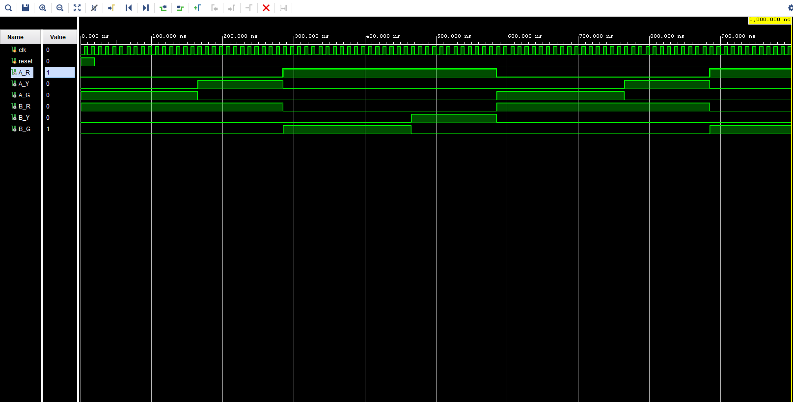
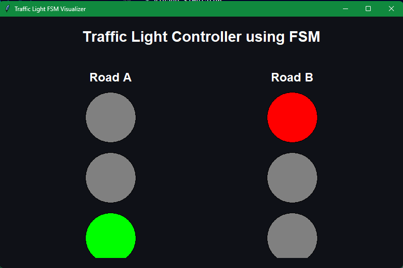

# Traffic Light Controller using FSM

## Overview

This project implements a Finite State Machine (FSM) based Traffic Light Controller using Verilog HDL. The system controls traffic signals for two roads using sequential state transitions and timing-based signal control.

The project also includes behavioral simulation, waveform verification, VCD generation, Python-based visualization, and GitHub Actions CI workflow integration.

---

## Features

* FSM-based Traffic Light Control
* Verilog HDL RTL Design
* Clock Divider Integration
* Behavioral Simulation & Verification
* VCD Waveform Generation
* Python Tkinter Visualization
* Basys 3 FPGA Support
* GitHub Actions CI Workflow

---

## FSM State Flow

```text
S0 → S1 → S2 → S3 → S0
```

| State | Road A | Road B |
| ----- | ------ | ------ |
| S0    | Green  | Red    |
| S1    | Yellow | Red    |
| S2    | Red    | Green  |
| S3    | Red    | Yellow |

---

## Project Structure

```text
Traffic-Light-Controller-FSM/
│
├── rtl/
│   ├── traffic_light_controller.v
│   └── clock_divider.v
│
├── tb/
│   └── traffic_light_tb.v
│
├── constraints/
│   └── basys3.xdc
│
├── waveform/
│   └── fsm_full_cycle_waveform.png
│
├── verification/
│   └── verification_notes.md
│
├── visualization/
│   ├── traffic_visualizer.py
│   ├── traffic.vcd
│   └── traffic_visualizer_output.png
│
├── .github/
│   └── workflows/
│       └── verilog-ci.yml
│
└── README.md
```

---

## Tools & Technologies

* Verilog HDL
* Xilinx Vivado
* Basys 3 FPGA
* Vivado Simulator
* Python
* Tkinter
* VCDVCD
* GitHub Actions

---

## Waveform Simulation

Behavioral simulation was performed in Vivado to verify FSM transitions and traffic signal sequencing.



---

## Python Visualization

A Python Tkinter-based visualizer was developed to demonstrate FSM traffic signal behavior using Verilog simulation outputs.

### Visualization Features

* Real-time Traffic Light Animation
* FSM State Demonstration
* Traffic Signal Sequencing
* Verilog-linked Visualization Flow



---

## GitHub Actions CI Workflow

Automated CI workflow was implemented using GitHub Actions.

### CI Features

* Automatic Verilog Compilation
* Behavioral Simulation Validation
* Python Script Verification
* Continuous Integration Support

---

## Verification Summary

### Verified FSM Sequence

```text
S0 → S1 → S2 → S3 → S0
```

### Verification Performed

* FSM State Transition Validation
* Waveform Analysis
* Output Signal Verification
* Clock Divider Validation
* VCD Generation & Parsing
* Python Visualization Validation

---

## FPGA Support

The design includes Basys 3 FPGA constraint support for future hardware implementation and real-time traffic light demonstration.

---

## Future Enhancements

* Smart Traffic Density Detection
* Pedestrian Crossing Control
* Emergency Vehicle Override
* Real-time FPGA Hardware Demonstration
* Advanced Verification using SystemVerilog Assertions

---

## Contributors

### Sriya Adimulam

* RTL Design
* FSM Implementation
* FPGA Constraint Integration

### Lakshmi Omkareswar Thummagunta

* Verification & Simulation
* Waveform Validation
* Python Visualization
* Documentation & CI Workflow

---

## Conclusion

This project demonstrates the complete workflow of digital system design including RTL development, FSM implementation, simulation, verification, waveform analysis, Python-based visualization, and CI automation using GitHub Actions.
